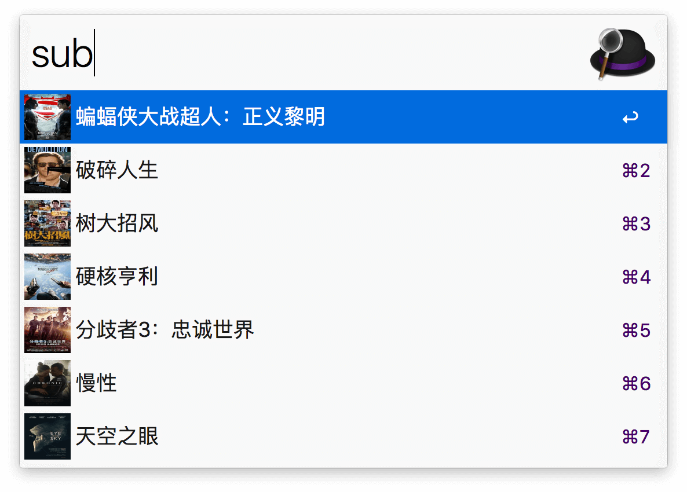

# AlfredWorkflow-SubHD-HotFilms

 一个快速获取SubHD.com 热门影视的Alfred Workflow
 
 ****
 
（7月2日更新，推荐如下整合版：[一个快速获取SubHD、Kat.cr、电影天堂的资源信息列表的Alfred Workflow](https://github.com/Jeff2Ma/AlfredWorkflow-DYHub) ） 
 
## 基本说明

这是一个可以通过Alfred 的关键词快速获取[SubHD.com](http://subhd.com/) 首页热门影视的Alfred Workflow。使用Python 语言编写，支持最新的Alfred 3。

使用本Workflow 前请确保你的Alfred APP 的Powerpack 功能已经解锁。

## 效果预览

 

## 下载地址
 
[点击下载](https://github.com/Jeff2Ma/AlfredWorkflow-SubHD-HotFilms/blob/master/SubHD-HotFilms.alfredworkflow?raw=true)

## 其它

Powered by JeffMa at [DeveWork.com](http://devework.com/)， feel free to use :)

